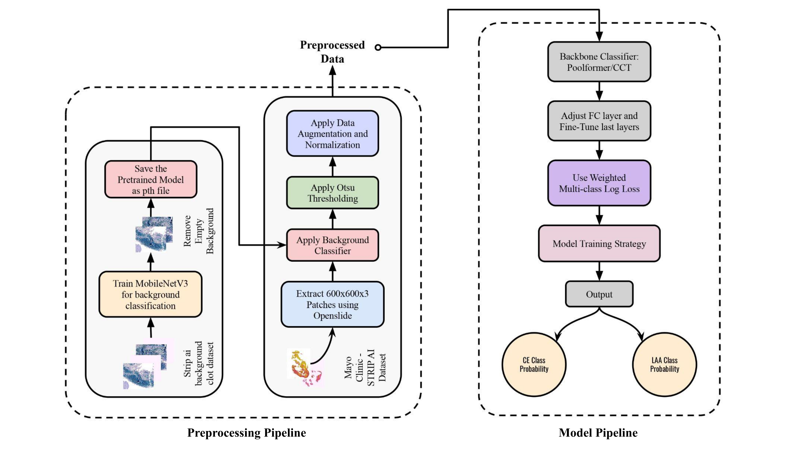
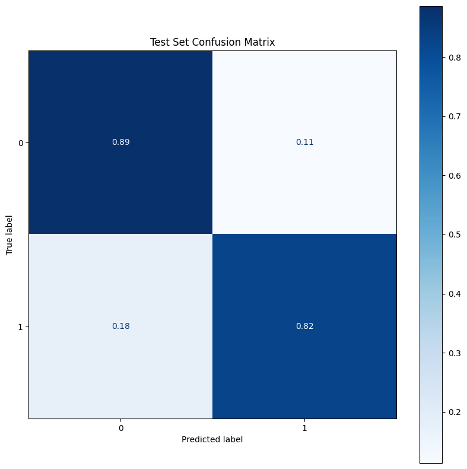

# Deep Learning for Classifying Ischemic Stroke Blood Clots

<div align="center">
    
</div>


This repository contains the implementation of deep learning models for classifying the origins of ischemic stroke blood clots using histopathological images. The project focuses on distinguishing between cardioembolic (CE) and large artery atherosclerosis (LAA) origins using advanced architectures including PoolFormerV3 and Compact Convolutional Transformers (CCT).

## Key Features
- Advanced deep learning architectures (PoolFormerV3 and CCT)
- Comprehensive data preprocessing pipeline
- Robust augmentation techniques
- Transfer learning implementation
- Ensemble model approach
- Performance evaluation metrics

## Repository Structure
```
├── Notebook/
├── Utils/
│   ├── helper.py
│   ├── huggingface.py
│   └── viz.py
├── files/
│   ├── Deep Learning for Classifying.pdf
│   ├── back-classifier.pth
│   ├── cm1.png
│   ├── graphs.png
│   └── valid_imagesv2.csv
├── src/
│   ├── models/
│   │   ├── CCT.py
│   │   └── poolfromer.py
│   ├── preprocessing/
│   │   ├── augmentation.py
│   │   ├── background_classifier.py
│   │   ├── otsu.py
│   │   └── patch_splitter.py
│   └── trainer/
│       ├── loss.py
│       └── trainer.py
```

## Dataset
The project utilizes two main datasets:
1. STRIP AI background clot dataset (19,998 images)
   - Used for background classification
   - 50% cell content images, 50% empty patches
2. Mayo Clinic STRIP AI dataset
   - Primary dataset for clot origin classification
   - Accessed through Kaggle

## Methodology

### Data Preprocessing
1. **Image Extraction**
   - Resizing of whole-slide images (WSIs)
   - Extraction of 600×600×3 pixel patches using OpenSlide
   - Conversion to PNG format

2. **Quality Control**
   - Background classification using MobileNetV3
   - Otsu's thresholding for content validation
   - Removal of low-quality patches (30% content threshold)

3. **Data Augmentation**
   - Image resizing to 224×224 pixels
   - Random horizontal/vertical flips
   - 90-degree rotations
   - Brightness/contrast adjustments
   - Shift-scale-rotate transformations
   - ImageNet normalization

### Model Architectures

1. **PoolFormerV3**
   - Transfer learning approach
   - Custom FC layer for binary classification
   - Dropout and batch normalization

2. **Compact Convolutional Transformers (CCT)**
   - Hybrid architecture
   - Efficient parameter usage
   - Optimized for limited datasets

### Training Configuration
- Optimizer: AdamW with weight decay
- Dynamic learning rate scheduler
- Early stopping mechanism
- Checkpoint saving
- Validation metrics monitoring

## Results

| Model      | Loss    | Accuracy | Precision | Recall | F1-Score |
|------------|---------|----------|-----------|---------|-----------|
| PoolFormer | 0.5576  | 87.52%   | 0.8643    | 0.8752  | 0.8691    |
| CCT        | 0.6812  | 85.53%   | 0.8513    | 0.8553  | 0.8532    |



### Key Findings
- PoolFormer achieved superior validation performance
- CCT demonstrated faster training times (~475s/epoch vs ~984s/epoch)
- Balanced performance across CE (89%) and LAA (82%) classifications

## Requirements
```python
torch
torchvision
albumentations
openslide-python
numpy
pandas
scikit-learn
```

## Usage
1. Clone the repository:
```bash
git clone https://github.com/yourusername/stroke-clot-classification.git
```

2. Install dependencies:
```bash
pip install -r requirements.txt
```

3. Prepare your dataset following the preprocessing pipeline in `src/preprocessing/`

4. Train the model:
```bash
python src/trainer/trainer.py
```

## Citation
If you use this code in your research, please cite:
```bibtex
@article{eid2024classifying,
  title={Classifying Ischemic Stroke Blood Clot Origin: A Comprehensive Study with Ensemble Models},
  author={Abomandour, Mohamad and Maged, Ali, and Mosilhy, Mohamed and Ahmed, Omar},
  year={2025}
}
```

## License
This project is licensed under the MIT License - see the LICENSE file for details.

## Acknowledgments
- Mayo Clinic for the STRIP AI dataset

## Contributors <a name = "Contributors"></a>
<table>
  <tr>
    <td align="center">
    <a href="https://github.com/MohamedMandour10" target="_black">
    
    <br />
    <sub><b>Mohamed Elsayed Eid</b></sub></a>
    </td>
    <td align="center">
    <a href="https://github.com/mohamedmosilhy" target="_black">
    
    <br />
    <sub><b>Mohamed Mosilhy</b></sub></a>
    </td>
    <td align="center">
    <a href="https://github.com/alimaged10" target="_black">
    
    <br />
    <sub><b>Ali Maged</b></sub></a>
    </td>
      </tr>


